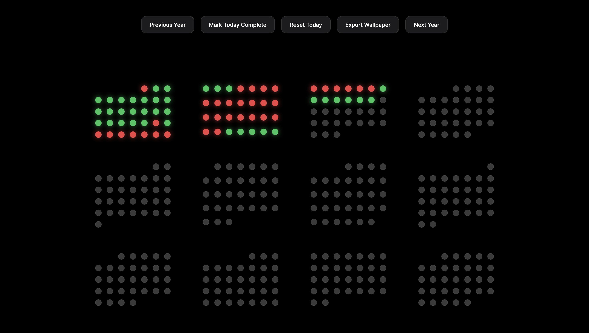
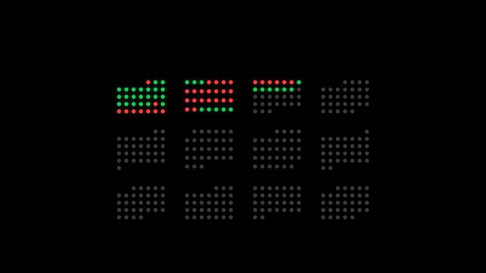

# React Habit Tracker

A minimalist, aesthetically pleasing 12-month habit tracker built with React. Track your daily habits over an entire year with an Apple-style interface, smooth animations, and a gorgeous dark mode design.

### App Preview


### Wallpaper Export Preview


## Features

- **12-Month Calendar View**: A clear, bird's-eye view of your year with a 4x3 grid layout.
- **Color-Coded Days**:
  - 🟢 **Green (Glowing)**: Completed on that day.
  - 🔴 **Red (Glowing)**: Missed (past days automatically mark as missed if not completed).
  - ⚫ **Dark Grey**: Future days yet to come.
- **Interactive Toggles**: Click any dot to toggle its completion status.
  - *Note: You can only update the status of habits for today and the last 7 days. Future days cannot be updated.*
- **Day Tooltips**: Hover over any day's circle to instantly see the day number.
- **Multi-Year Navigation**: Dynamically cycle through previous and future years.
- **Persistent Local Database**: Uses an embedded Express server that automatically reads and syncs your progress into a local `data/progress.json` file. Your changes are automatically saved and loaded every time you run the app!
- **High-Res Export**: Turn your yearly progress graph into a custom 4K desktop wallpaper with a single click ("Export Wallpaper"). Note: Navigation buttons are automatically hidden from the wallpaper export.
- **Quick Actions**: Handy buttons to quickly "Mark Today Complete" or "Reset Today".

## Tech Stack

- **React**: Functional components and Hooks (`useState`, `useRef`, `useEffect`).
- **Node.js & Express**: Lightweight backend to serve and update the JSON database.
- **Vanilla CSS**: Grid layouts and smooth transition animations with custom pseudo-elements for tooltips.
- **html2canvas**: Used to generate the 4K wallpaper exports.
- **Concurrently**: Runs both the React app and Express server simultaneously.

## Getting Started

### Prerequisites

Make sure you have [Node.js](https://nodejs.org/) installed on your machine.

### Installation

1. Clone or download this repository.
2. Open your terminal and navigate to the project directory:
   ```bash
   cd react-habbit-tracker
   ```
3. Install the dependencies:
   ```bash
   npm install
   ```

### Running the App

Start both the React development server and the Node JSON server simultaneously:
```bash
npm start
```

The app will compile and open automatically in your default browser at `http://localhost:3000`. Your data server runs silently on `http://localhost:3001`.

## Usage

1. **Marking a Habit**: Click on a circle corresponding to a specific day to toggle the habit's status to "Completed". Remember, you can only track today and up to 7 days in the past!
2. **Checking the Date**: Hover over any dot to see which day of the month it represents.
3. **Navigating Years**: Use the **Previous Year** and **Next Year** buttons at the top to scroll chronologically through time.
4. **Making a Wallpaper**: Click **Export Wallpaper** to download a beautifully rendered `<year>.png` of your habit calendar for the year you are currently viewing.

## Customization

The UI and colors can be easily modified in `src/styles.css`.
